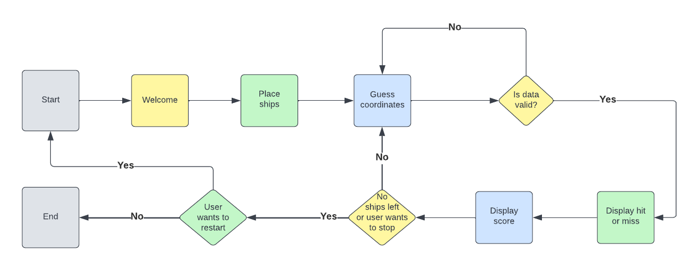
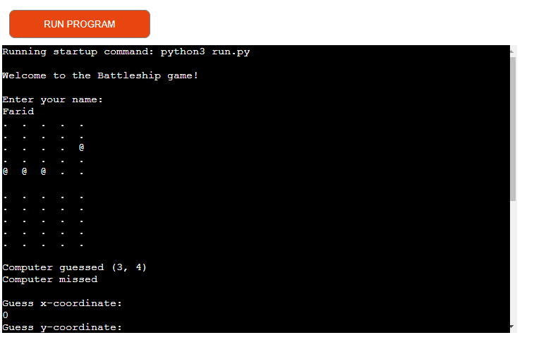

# The battleship game
The battleship game is a computer version of the classic paper and pen game. It is game for two players. Each player has a board with ships and try to guess the position of the ships of the other player to sink them. In the computer version the user plays against the computer. 

# Table of contents

# UX

# Structure of the project
To facilitate the development of the project the algorithm of the game was visualized in a flow diagram using the website lucidchart.

# Features
The programme starts by printing a welcome message. Random positions are chosen for the ships in both boards. The player guesses a position to try to hit a ship of the computer. The position is validated. The computer also chooses a (random) position to try to sink the player's ship. The program checks if the guesses result in hits or misses and displays the score. The boards are printed. The game continues until all the ships of one side are sunk or the player wants to end the game. He can also choose to see the score of the five latest games. Finally he can either start a new game or stop playing.

# Technologies used
- Python for the code
- Github for cloud-based storage of project and deployment
- GitPod for development
- Git for version control

# Testing

## Functionality testing
I tested that the coordinates entered are not repeated; that they are integers between 0 and gridsize - 1; and that the input name is not an empty string.

## Code validation
The code passed through the PEP8 linter without errors.

## Unfixed bugs
There is no unfixed bugs

# Deployment
The application was deployed using the Code Institute mock terminal in Heroku. The steps for deployment are as follow.
- Create an app in Heroku.
- Set environment variables.
- Add the backpacks for Python and Node.js in the correct order.
- Connect to the github repository.
- The application is ready to be deployed

# Credit
My inspiration came from the love sandwiches walkthrough project and from the video about the battleship game example application.
